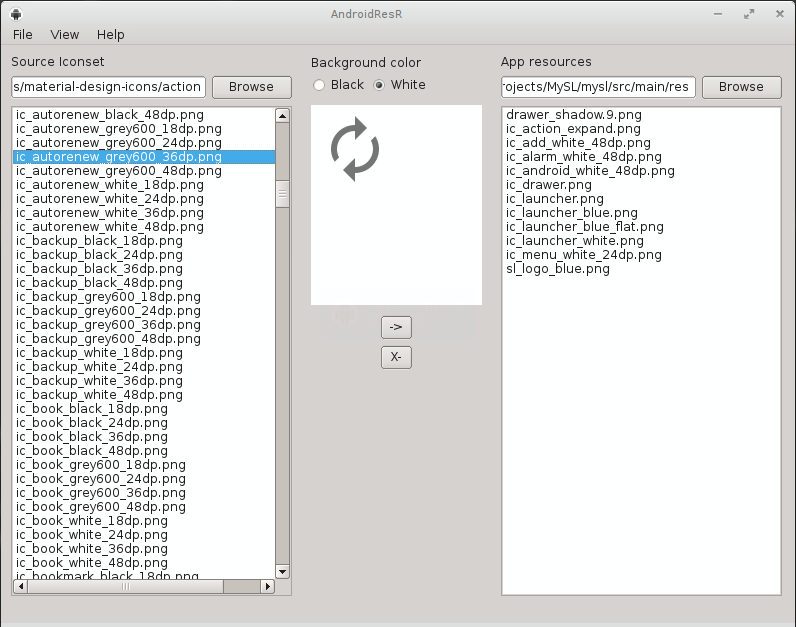

# AndroidResR

A resource (icon) manager for Android apps

## Install
Get PyQt4

    sudo apt-get install python-qt4

Get AndroidResR from PyPi

    sudo pip install AndroidResR

## License

    AnrdoidResR - A android resorce manamgent tool
    Copyright (C) 2014 Victor H'ggqvist

    This program is free software; you can redistribute it and/or modify
    it under the terms of the GNU General Public License as published by
    the Free Software Foundation; either version 2 of the License, or
    (at your option) any later version.

    This program is distributed in the hope that it will be useful,
    but WITHOUT ANY WARRANTY; without even the implied warranty of
    MERCHANTABILITY or FITNESS FOR A PARTICULAR PURPOSE.  See the
    GNU General Public License for more details.

    You should have received a copy of the GNU General Public License along
    with this program; if not, write to the Free Software Foundation, Inc.,
    51 Franklin Street, Fifth Floor, Boston, MA 02110-1301 USA.
